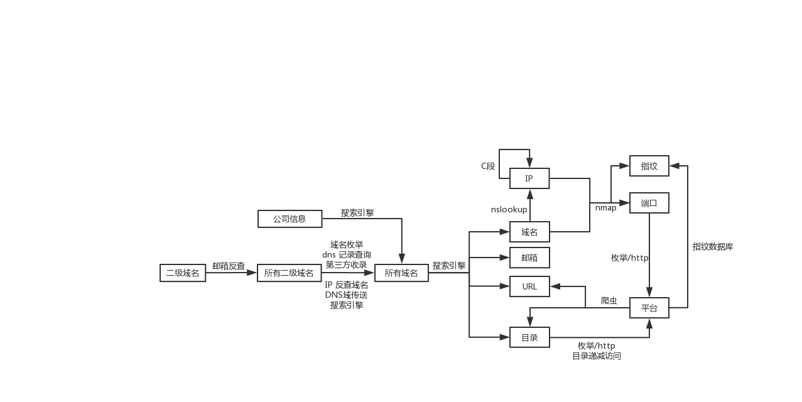

# InformationCollection

## 编写初衷  

在众测挖掘过程中，资产信息收集无疑是第一步需要做的，很多漏洞并没有那么复杂，api暴露后随便FUZZ一下甚至就可发现漏洞，所以为了方便公网渗透过程，我编写了此资产信息收集框架。

---

## 环境搭建  

- python 3.6+
- mysql
  - 账号密码在 config.py 中配置
- mongodb
  - 端口号在 config.py 中配置
- nmap

---

## 运行过程

因为自己使用，自身写了一个很简陋基于 django 的前端，在此就不上传，可自行安装 phpmyadmin 查看数据库，表名以及列名都很明显

```sh
pip3 install requests pymongo pymysql python-nmap esd
python3 run.py ${domain} ${company}
# example: python3 run.py qq.com tencent
```

---

## 实现过程

下图是设计之初对整个框架流程的思考，最后完成度与该图有一些不同



---

### 搜索引擎模块

**数据：**  
使用 site inurl 等功能将 url domain params 等储存进入数据库

开始时，我本着多多益善的思路，将各种搜索引擎都整合进来，包括百度、必应、谷歌 、雅虎、搜狗 、360等，但在测试阶段，必应、谷歌等搜索引擎反爬虫机制成熟，再加上大多搜索引擎收录的数据重复性较大，所以在对爬取结果影响不大的情况下，仅留下了百度以及360这两种较稳定的搜索引擎爬取结果。  

在实现模块过程中，考虑到了两种方式：  

1. 通过 python request 请求，获取返回数据，再通过正则表达式来过滤  
2. 通过 pyppeteer 模拟浏览器行为，然后通过 javascript 获取数据

最后，出于效率以及稳定性，我选择了第一种方式来完成该模块 

---

### SSL模块

**数据：**  
获取同证书的其他域名

同一家公司有时会对多个域名使用相同的证书，一些第三方网站对此有一定记录，本模块使用了 [crt](https://crt.sh) 的数据

---

### Nmap模块

**数据：**  
获取 ip 的所有端口，指纹

---

### 子域名爆破模块

**数据：**  
获取域名的子域名

在编写该模块时，查看了网上许多开源工具，包括 subDomainBrute 等等，经过比较，python 第三方库 esd 的效率以及稳定性都比开源工具要强很多，所以我选择使用 esd

---

### VirusTotal 模块

[VirusTotal](https://www.virustotal.com/gui/) 是一个非常全面的信息收录网站，通过该网站可以获取子域名，历史 DNS 解析等等数据

---

### 数据库模块

数据库模块分为两部分

1. mysql
2. mongodb

mysql 记录 ip 域名 端口 状态等信息  
mongodb 记录 url
由于主进程为多线程实现，所以数据读写或许会有冲突，已手动加锁

---

### 主模块

由于有些二级域名子域名集过于庞大，数据处理比较慢，所以即使 python 多线程不能加大 CPU 利用率，为了防止卡死，在某一单元上消耗太大时间，我还是使用了多线程来完成。  
每一个域名的信息收集为一个子线程。  

---

## 总结

最开始编写该框架时，所使用的为 python2.7，在逐渐完善模块过程中，包括考虑一些 python3 开源工具以及协程等 python2 所不支持的特性，实现起来过于繁琐，所以在编写完成后使用了 python3 进行重构。  

信息收集远远不止这些模块可以概括，实现过程中，我曾经把 robots.txt DomainXML DNS收录 目录爆破等模块加入框架中，但测试后发现有效数据并没有增加多少，但效率以及稳定性缺降低了许多，所以在该版本中将以上模块删除。  

作为一个扫描器来讲，该框架功能有限，今后我也会不断完善，添加 web fuzz 以及其他功能。
